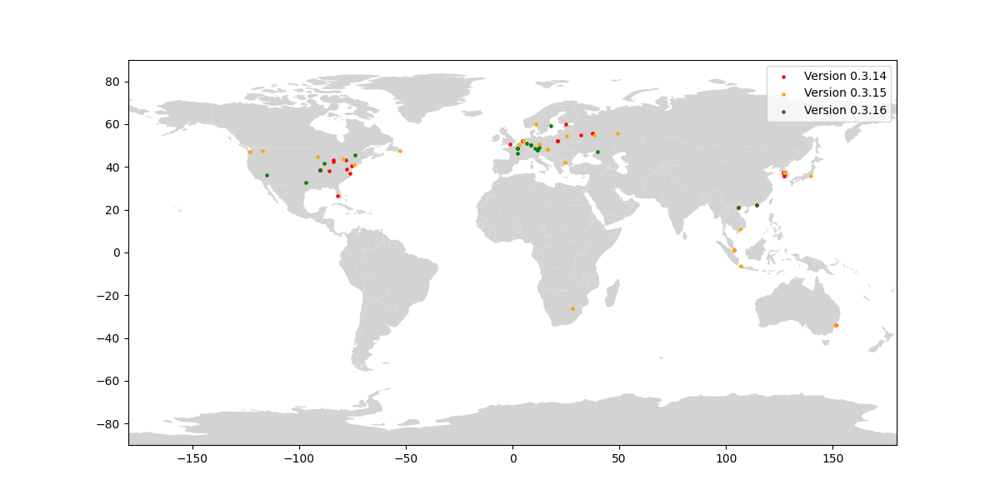

# Spectre P2P Crawler

## Overview

This project provides a crawler to discover and map public nodes on the Spectre network. Using the Spectre P2P protocol, it retrieves peer information and visualizes nodes by geolocation and version. Key outputs include a global node map and analysis metrics.



## Prerequisites

- **Python** 3.10+
- **Pipenv**
- **app.ipgeolocation.io API Key** (add to `.env` as `IPGEOLOCATION_API_KEY`)
- **world map**

The world map was downloaded from **Natural Earth** and is located in `admin_0_countries`. This is a shapefile dataset containing geographical boundaries of countries, which can be loaded using GeoPandas for plotting.

- **Source:** The map data can be found on the [Natural Earth website](https://www.naturalearthdata.com/downloads/110m-cultural-vectors/).

## Setup

1. **Install dependencies** using Pipenv:
   ```bash
   pipenv install
   ```
2. **Set Environment Variables**:
   Add to `.env`:
   ```plaintext
   SEED_NODE=<starting node IP:PORT>
   IPGEOLOCATION_API_KEY=<your_ipgeolocation_api_key>
   VERBOSE=1 (configures the logging level based on the value of the VERBOSE)
   ```

## Running the Crawler

Start the crawler and API server to gather and geolocate nodes:

```bash
pipenv run uvicorn main:app --host 0.0.0.0 --port 8000
```

This periodically queries nodes, retrieves geolocation, and updates `nodes.json`.

## Node Map Visualization

Generate a map with nodes color-coded by version:

```bash
python scripts/plot_map.py --input data/nodes.json --output spectred_nodes.png
```

## Node Analysis and Filtering

Analyze the network, filtering duplicates by node ID and IP. Counts unique nodes by version:

```bash
python scripts/analyze_nodes.py
```

Sample output:

```plaintext
Total unique nodes: 205
Spectred v0.3.14: 152
Spectred v0.3.15: 32
Spectred v0.3.16: 21
```

## Details

### P2P Crawler (`spectre_crawler.py`)

- establishes gRPC connections with peers in the Spectre P2P network on port `18111`, performing a handshake to verify if nodes are active and compatible with the protocol version.
- only nodes that have port `18111` open and allow inbound connections can be reached. If a node’s port `18111` is closed, it may still function in the network but won’t be accessible to this crawler since `18111` is essential for P2P communication in Spectre.
- requests peers directly through the P2P protocol's `requestAddresses` rpc call.
- for each unique IP address, the crawler queries the IPGeolocation API to fetch approximate coordinates, avoiding re-fetching for nodes that already have geolocation data.
- using RELOAD_ALL=1 (default is 0), forces a refresh of all nodes with a new geolocation request, including those that already have `loc` data.
- This IP-based geolocation is approximate, with database accuracy likely around 90%.
- this crawler does not aim to retrieve a full list of all network nodes. It maps active and reachable nodes, to visualize the global distribution and diversity of the nodes participating in Spectre.

Results are stored in JSON format, structured by node attributes such as IP address, geolocation, node ID, and `spectred` version.

### API Server (`main.py`)

The API server uses FastAPI to:

- triggers the crawler on startup and schedules it to run every 60 minutes.
- skips nodes with existing location data, only updating new entries.
- logs each update, including successful geolocation retrievals and any errors.

## Increasing File Descriptor Limit

To avoid "Too Many Open Files" errors, increase the system file limit (Linux/Mac only):

```bash
ulimit -n 22000
```
